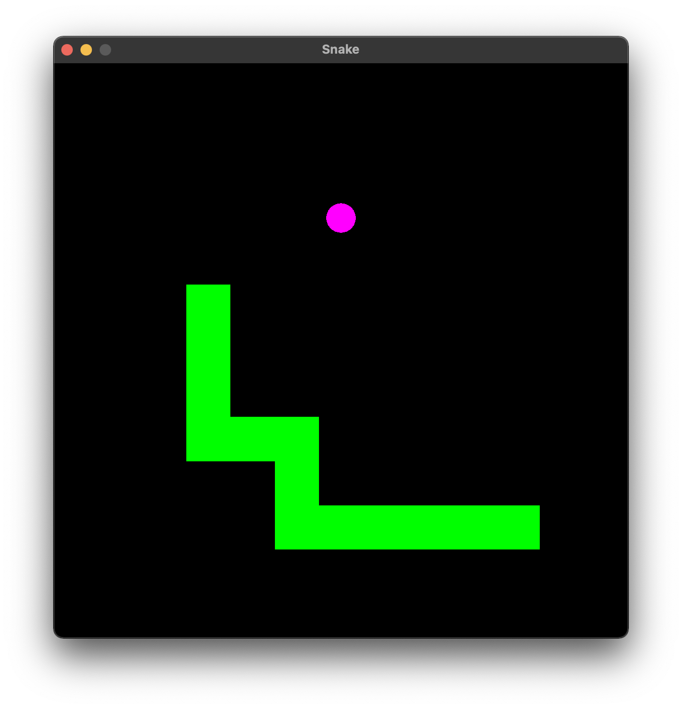

# Snake


Snake written using [SFML](https://github.com/SFML/SFML).

<p align="center">
  
  
</p>

## Keybindings

| Key(s) | Action |
| ------ | ------ |
| Arrows<br>WASD | Move snake |

## Build from source

### Install dependencies

```bash
# macOS
brew install cmake sfml

# Ubuntu
sudo apt install cmake libsfml-dev
```

### Build and run

```bash
# Clone
git clone https://github.com/giuuliorusso/snake-sfml
cd snake-sfml

# Build
cmake -S . -B build
cmake --build build

# Run
./build/snake_sfml
```

## License

[MIT](./LICENSE)
